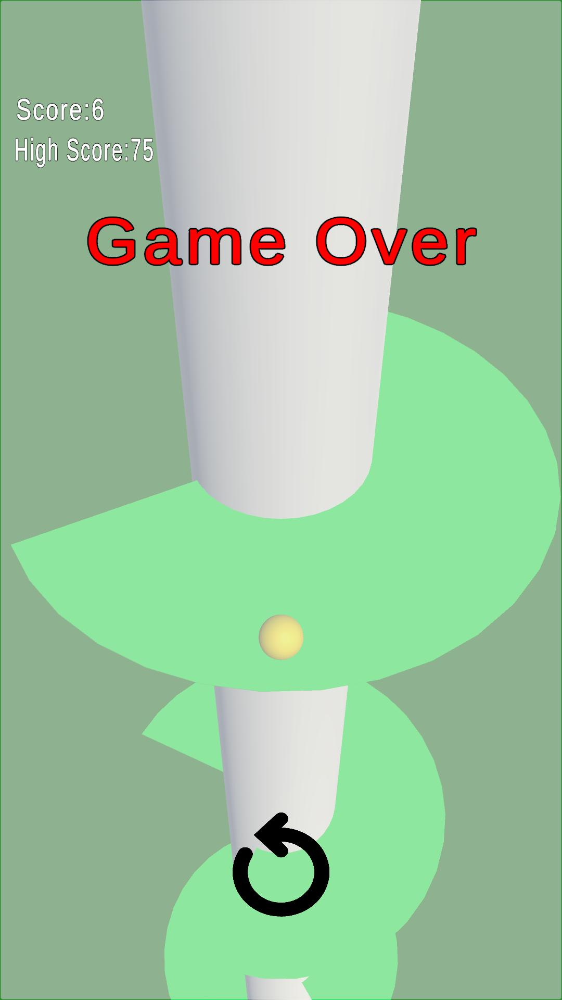

# Helix Jump
## Introduction

This project is a clone of the popular mobile game Helix Jump, developed using Unity. The game is optimized for performance by implementing an Object Pooling System, ensuring smooth gameplay and an infinite loop experience. The objective of the game is to score points by passing through the cylinders.

 

 

## About the Game
  &nbsp;&nbsp;&nbsp; 1.Objective: To pass through the gaps in the cylinder.
  
  &nbsp;&nbsp;&nbsp; 2.Both the ball and the stick remain stationary while the rollers move upwards.
  
  &nbsp;&nbsp;&nbsp; 3.Players score points each time the ball successfully passes through a gap.
  
  &nbsp;&nbsp;&nbsp; 4.The cylinders leaving the screen are repositioned at the bottom, creating an endless game loop.
  

  

   
   

## How To Play?
&nbsp;&nbsp;&nbsp; 1. Click the Start button to begin the game.

&nbsp;&nbsp;&nbsp; 2. Static Ball and Rod: The ball remains stationary and moves as part of the rod.

&nbsp;&nbsp;&nbsp; 3. Control the Rod: Rotate the rod left and right to guide the ball through the gaps in the platforms.

&nbsp;&nbsp;&nbsp; 4. Earn Points: You gain points every time the ball passes through a platform's gap.

&nbsp;&nbsp;&nbsp; 5. Break Records: Avoid hitting the platforms and play as long as possible to achieve high scores!

 ## Features
 &nbsp;&nbsp;&nbsp; Object Pooling System: Optimized memory usage by reusing platform objects.
 
 &nbsp;&nbsp;&nbsp; Endless Loop: Platforms are continuously repositioned for seamless gameplay.
 
 &nbsp;&nbsp;&nbsp; Dynamic Scoring System: Points increase with every successful pass through a platform.
 
 &nbsp;&nbsp;&nbsp; Smooth Gameplay: Simple mechanics ensure a user-friendly experience.

## Technical Details 

  ### Technologies Used
  
Unity: Game engine used for development.

C#: Programming language for all game logic.

Git: Version control system to manage the project.

## Developer

This project was developed to improve my Unity game development skills and deliver a fun experience.

## Contributing

Feel free to submit a Pull Request or create an Issue if you have suggestions, bug reports, or want to contribute to the project.

## Installation

To run the Helix Jump game on your Windows system, follow these steps:

    1. Clone this repository or download it as a ZIP file.
    2. Open the project in Visual Studio or your preferred C++ IDE.
    3. Build and run the project.

### Downloading Release and Playing

You can easily download and play the game by following these steps:

    1. Go to the Releases section of this repository.
    2. Find the latest release and click on it.
    3. Download the v1.0.1.zip file from the release.
    4. Unzip the zip file.
    5. Run    to start playing the game !

